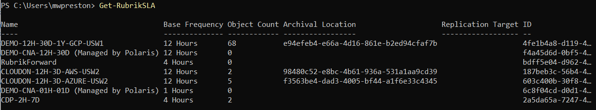

# FAQ

This section will contain a list of common questions that have been received (and answered) by the Project Team.

- [How do I install the devel branch of the Rubrik SDK for PowerShell?](#how-do-i-install-the-devel-branch-of-the-rubrik-sdk-for-powershell)
- [Why do I see only a subset of object properties?](#why-do-i-see-only-a-subset-of-object-properties)
- [Why is the returned data different when I filter objects based on name vs based on their id value?](#why-is-the-returned-data-different-when-i-filter-objects-based-on-name-vs-based-on-their-id-value)

## How do I install the devel branch of the Rubrik SDK for PowerShell?

In order to test new features or cmdlets which have been developed you may wish to run the `devel` branch of the Rubrik SDK for PowerShell. All new functionality first lands within the `devel` branch before it is migrated to `master` during a module release. The easiest way to install and test the `devel` branch is as follows:
1. Clone the GitHub repository to a local folder

    `git clone https://github.com/rubrikinc/rubrik-sdk-for-powershell c:\test\`

1. Traverse to the local directory the module was cloned in and checkout the `devel` branch

    `cd c:\test\
    git checkout devel`

1. Import the Rubrik Module, specifying the path to the newly cloned repository

    `Import-Module c:\test\Rubrik -Force`


## Why do I see only a subset of object properties?

By default, custom view definitions are applied to the output of some results that cmdlets return. For instance, running `Get-RubrikSLA` only shows the Name, Base Frequency, Object Count, Archival Location, Replication Location and Id by default.



Rest assured though, all properties are returned and can be viewed by simply piping the cmdlet to Select * ( `Get-RubrikSLA | Select *` ) or referencing the property directly ( `(Get-RubrikSLA).numVms` ).

The application of custom view definitions may also be turned on and off with the configuration of the `ApplyCustomViewDefinitions` module option as well.

```powershell
Set-RubrikModuleOption -OptionName "ApplyCustomViewDefinitions" -OptionValue "False"
```

## Why is the returned data different when I filter objects based on name vs based on their id value?

Many Rubrik API endpoints are designed in such a way that they provide lists of objects as a response when querying a simple object type, and a more detailed response when sending the actual ID of the object. For instance, we are able to get a list of VMs by sending a GET request to the `/vmware/vm` endpoint. We can, if we desire, shorten this list by adding a `name` filter into the query. This process is the same as running `Get-RubrikVM -Name "VMName"`. By sending the id to the endpoint `/vmware/vm/{id}` we essentially ask for a more detailed response, equivalent to running `Get-RubrikVM -ID "12345"`. That said, we are able to use the `-Name` parameter along with the `-DetailedObject` parameter to retrieve the detailed response just as if we had passed the `-Id` parameter.

```powershell
Get-RubrikVM -Name "VMName" -DetailedObject
```


